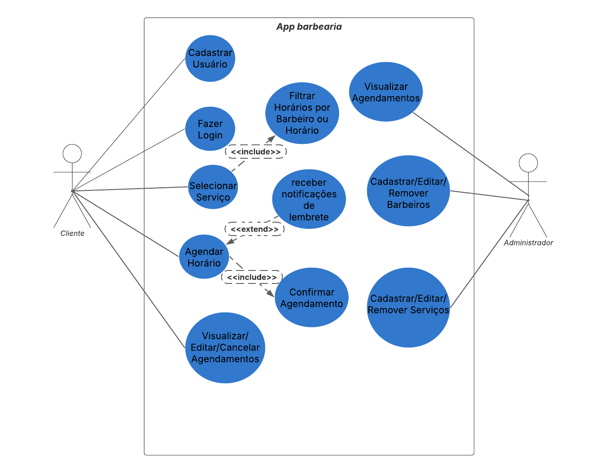

# Sistema de Agendamento para Barbearia

Este projeto é um sistema para agendamento de serviços em uma barbearia, contendo requisitos funcionais e não funcionais, histórias de usuário, casos de uso e diagrama de casos de uso.

---

## 📋 Conteúdo

- [Requisitos de Software](./docs/requisitos.md)
- [Histórias de Usuário](./docs/historias-de-usuario.md)
- [Casos de Uso](./docs/casos-de-uso.md)
- [Diagrama de Casos de Uso](./assets/diagrama-casos-de-uso.png)

---

## 🧑‍💼 Histórias de Usuário

Como cliente, posso criar conta, escolher serviços, agendar horário com barbeiros, visualizar e gerenciar meus agendamentos.

Como administrador, posso gerenciar barbeiros, serviços e visualizar todos os agendamentos.

---

## 🎯 Casos de Uso

- Cadastro e login de clientes.
- Seleção de serviços.
- Agendamento com escolha de barbeiro e horário.
- Gerenciamento de agendamentos.
- Administração dos barbeiros e serviços.

---

## 🖼️ Diagrama de Casos de Uso

---

## ⚙️ Tecnologias

- Markdown para documentação.
- Git e GitHub para versionamento e hospedagem do projeto.

---

## 👤 Autor

Gabriel Gonzaga

---

*Projeto criado para organização dos requisitos e documentação do sistema de agendamento de barbearia.*
